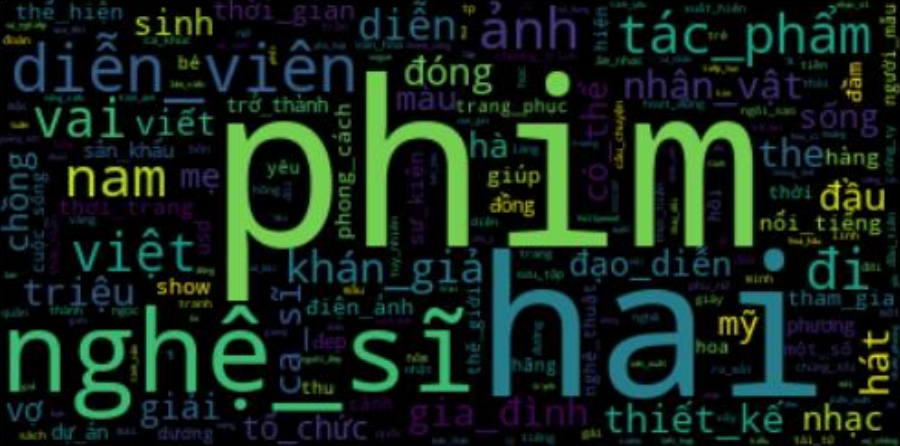

## Description
This project focuses on automatically classifying web articles into different categories such as Economy, Technology, Entertainment, Sports, Health, etc. The goal is to use natural language processing (NLP) and machine learning algorithms to build a model that can accurately analyze and label articles.

## Main features
* Article Crawling: Automatically crawl articles from various web sources through web scraping and API.
* Text preprocessing: Cleans and normalizes text data, including removing punctuation, stop words, and handling special characters.
* Extract text features: Use methods such as TF-IDF, Word Embeddings (Word2Vec, GloVe) to convert text into numbers.
* Article classification: Use machine learning algorithms such as Naive Bayes, SVM, Random Forest, and Deep Learning (LSTM, BERT) to classify articles by genre.
* Model evaluation: Use metrics such as Accuracy, Precision, Recall, and F1-score to evaluate model performance.
## Usage
* Python: The main language for data processing and model building.
* BeautifulSoup, Scrapy: Tools for collecting article data from the web.
* NLTK, SpaCy: Natural language processing library.
* Neural Network: Libraries for building and training machine learning and Deep Learning models.
* Matplotlib, Seaborn: Visualizing data and model results.
## Target
* Automate article classification: Reduce manual labeling effort and save time.
* Improve classification accuracy: Correct category classification helps improve search quality and recommend content to readers.
* Application in suggestion system: Helps news websites recommend articles that match readers' interests.

## Result
### WordCloud of each label

### Webapp Source Code

